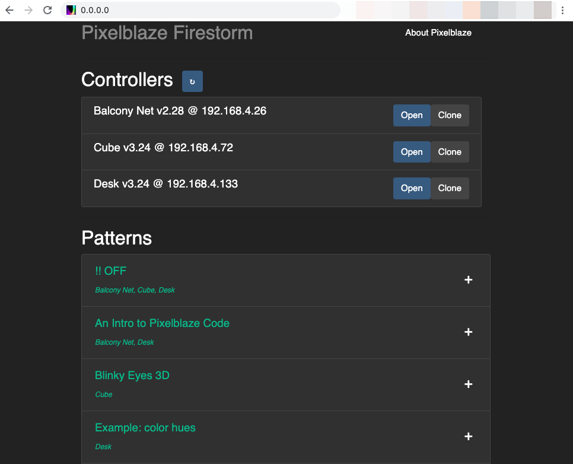

Firestorm
============

Pixelblaze Firestorm is a centralized control console for [Pixelblaze WiFi LED controllers](https://www.bhencke.com/pixelblaze).

It synchronizes pattern timers and allows switching patterns across all Pixelblaze controllers on a network.

Firestorm runs as a web server. When Firestorm is running, it detects all Pixelblaze controllers it can see on a network. You can then access Firestorm's UI from a web browser or use it headless via its HTTP API.


Installation
==========

Docker Usage
==========

To run this project in a docker environment, ensure you have docker installed wherever you want to run this, then run:

```bash
docker compose build
docker compose up
```

You can then view the UI on your machine at [http://0.0.0.0:8080/](http://0.0.0.0:8080/).

Running Locally
==========

Installing Firestorm involves cloning this project and running it from the command line. If you haven't already, install an LTS version of [Node.js](https://nodejs.org/en/download/package-manager/) and [Yarn](https://classic.yarnpkg.com/lang/en/docs/install/).

```
git clone https://github.com/simap/Firestorm.git
cd Firestorm

yarn
yarn build
yarn server

# or to run on a different port, in case you get access denied for port 80:
PORT=3000 yarn server
```

This installs the dependencies, compiles the react app portion, then serves the whole thing.

Installing on Raspberry Pi
=========

This can take some time, and might not be the most optimal path (if you have something better please let me know, preferably with a PR).

The following was validated working in June, 2022 for a clean install of Raspberry Pi OS (Raspbian) 10 (buster) and 11 (bullseye) on a Raspberry Pi 4.

```
# First get node and yarn going

# As of mid-2022, Debian 10 updates node to 10.24.0, which is not ok. 
# NodeSource maintains an APT repository containing the latest versions 
# of Node.js. First we'll add their repo for Node 16. A sufficient
# version of npm is included.
curl -sL https://deb.nodesource.com/setup_16.x | sudo bash -

# Configure the repo to use for yarn
curl -sS https://dl.yarnpkg.com/debian/pubkey.gpg | sudo apt-key add -
echo "deb https://dl.yarnpkg.com/debian/ stable main" | sudo tee /etc/apt/sources.list.d/yarn.list

sudo apt update
sudo apt install nodejs yarn authbind

# pm2 is a node process manager which helps Firestorm stay running in the background
sudo npm install -g pm2

# authbind lets us bind to port 80 as non-root
sudo touch /etc/authbind/byport/80
sudo chown pi /etc/authbind/byport/80
sudo chmod 755 /etc/authbind/byport/80

alias pm2='authbind --deep pm2'

# Run pm2 on boot
sudo env PATH=$PATH:/usr/bin /usr/lib/node_modules/pm2/bin/pm2 startup systemd -u pi --hp /home/pi
# If you get "No such file or directory", run `pm2 startup` to see the correct command

# now get Firestorm 
cd ~
git clone https://github.com/simap/Firestorm.git
cd Firestorm

yarn
yarn build

# I believe the pm2 alias with authbind is critical here
# Alternatively `authbind --deep pm2 start server.js` might work
pm2 start server.js 
pm2 save

```


Beacon and Time Sync Server
=========
Pixelblaze controllers running firmware v2.10 and above send out broadcast UDP packets that are used for discovery, and accept reply packets for time synchronization. The server participates in a time sync algorithm similar to NTP, allowing any number of Pixelblazes to have synchronized animations.


Firestorm UI
=========
If Firestorm installed correctly and is running, you'll be able to access the UI by browsing to the IP address or hostname (and port) it is running on.

For example, if you installed Firestorm on the same computer you want to access it from and it installed successfully on port 80, open:

[http://0.0.0.0](http://0.0.0.0)

If you installed it on a Raspberry Pi at 192.168.0.100 on port 3000, and are accessing it from a different computer on the same network, it would be acessible at [http://192.168.0.100:3000](http://192.168.0.100:3000).

The UI will show all unique pattern names on the network, and selecting a name will launch it on all Pixelblazes that have that pattern name. Launching a pattern will create a new client-driven sequence containing that single pattern. A pattern can be added to the current sequence by clicking the Add button to the right of its name. Once added, an icon will appear to the right of a pattern indicating whether it is the currently running pattern or part of the current sequence. To clear the current sequence, click a pattern name (which will create a new sequence that does not change unless additional patterns are added).



Firestorm API
=========
To automate things across multiple Pixelblazes without using a browser, you can use the Firestorm server as an HTTP API. The API is pretty simple at this point.

## /discover (GET)

Returns a list of all known Pixelblaze controllers along with their pattern list and current settings.

e.g.

```
[
  {
    "lastSeen": 1534033419191,
    "address": "192.168.1.215",
    "id": 6909667,
    "programList": [
      {
        "id": "8gjB89jqQojktXgc4",
        "name": "sparks"
      },
      ...
    ],
    "ver": "2.10",
    "exp": 0,
    "pixelCount": 100,
    "ledType": 1,
    "dataSpeed": 12000000,
    "colorOrder": "BGR",
    "sequenceTimer": 15,
    "sequencerEnable": false,
    "brightness": 1,
    "name": "Desk 2"
  },
  ...
]
```

## /command (POST)

Sets a stickly command state for the given Pixelblaze IDs.
`programName` is a bit special as it will convert to whatever ID has that name on the local Pixelblaze. This makes it easy to create different patterns, then name them similarly in order to create control groups.

Most other settings (e.g. the above) can be changed through this API, for example `brightness` (coming soon to the UI). Pattern upload and management is not supported in this API.

If a Pixelblaze is unavailable or drops off the network temporarily, the settings will be reapplied when it comes back, for up to 5 minutes.

```
{
  "command": {
    "programName": "blink fade"
  },
  "ids": [
    6909667,
    9398311
  ]
}
```

## /command (GET)

This is much like above, but implemented in a GET request for compatibility with systems that have a hard time issuing HTTP POSTs.

The command JSON should be URL encoded, and the ids are comma separated.

```
/command?command=%7B%22programName%22%3A+%22blink+fade%22%7D&ids=6909667,9398311
```

## /reload (POST)

Triggers reloading config and patterns from all controllers. No body is required.


## /clonePrograms (POST)

Clone all programs from one controller to another. Programs that are on the destinations that don't exist on the source will be deleted so that they match exactly.

```
{
  "from": 6909667,
  "to": [9398311,38473234]
}

```


